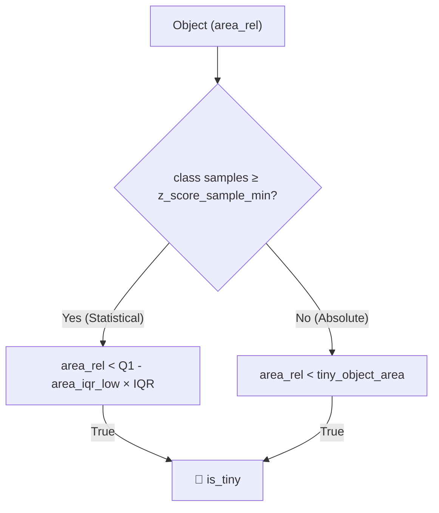
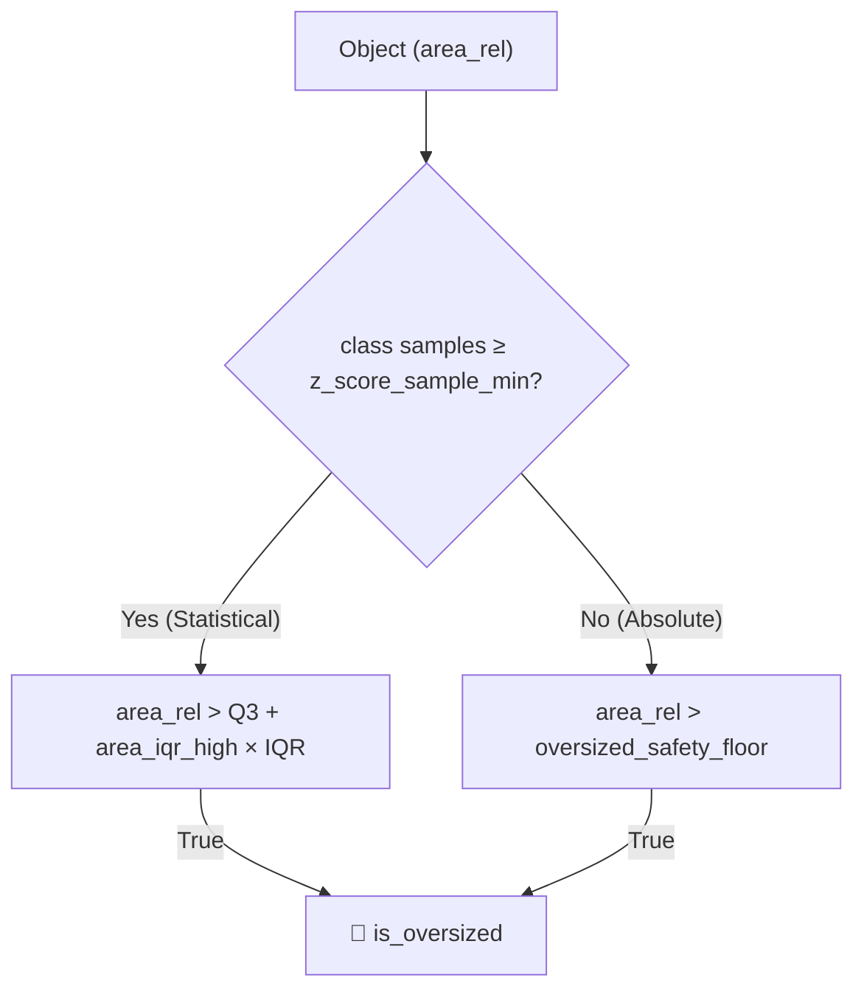
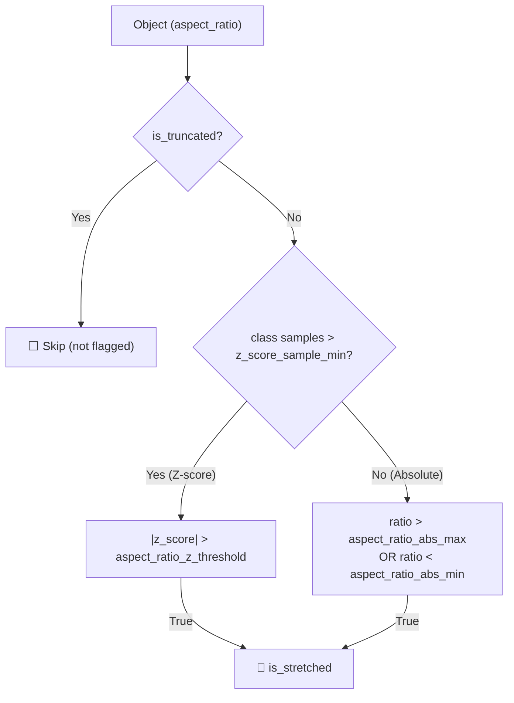
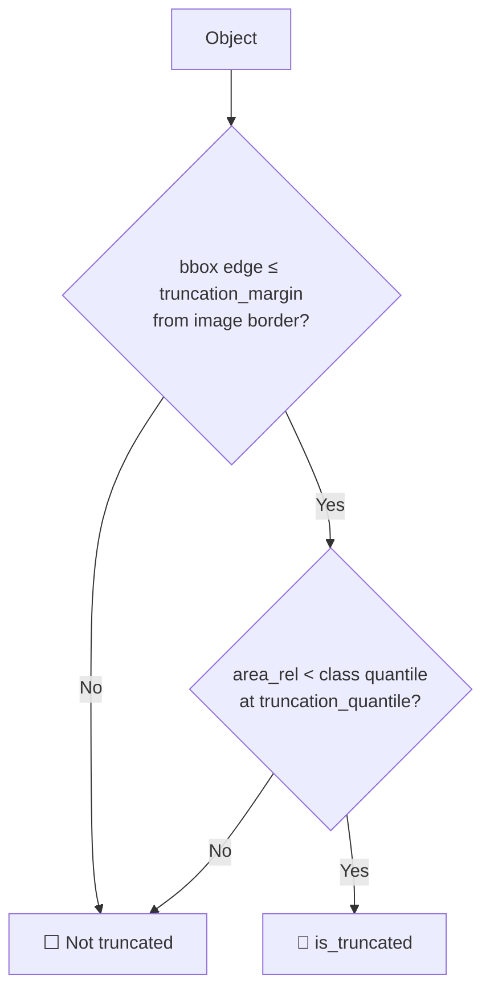
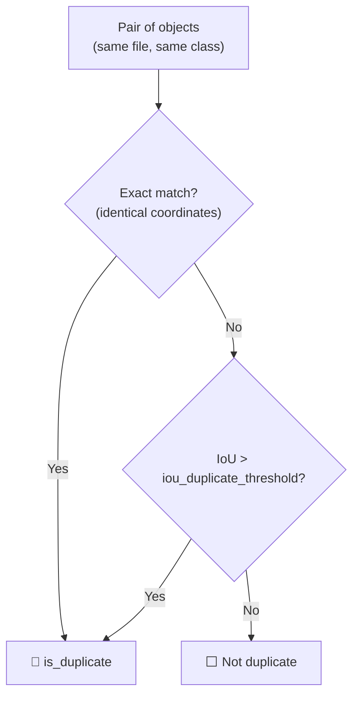

# YoloRustAnalyzer

A high-performance EDA tool for YOLO datasets, powered by Polars, Rust, and Kornia.

## Features
- **Speed**: Processes 100k+ files in seconds using modular architecture.
- **Lazy Evaluation**: Efficient memory usage with Polars lazy expressions.
- **Parallel Processing**: Multi-threaded image I/O with `kornia-rs`.
- **Modular Design**:
  - `DataLoader`: Robust file discovery and IO validation.
  - `MetricsEngine`: Pure logic for geometric calculations.
  - `Visualizer`: Parallelized mosaic generation and dashboard plotting.
- **Dashboard**: Comprehensive visualization of dataset statistics including frequency, spatial distribution, and integrity metrics.
- **Outlier Reporting**: JSON reports identifying potential dataset anomalies (tiny objects, class-relative outliers, duplicates).
- **Crop Generation**: High-performance tool (`generate_cropset.py`) to create fixed-size crops from large images.
  - Centered object crops with label recalculation.
  - **Background Crops**: Automated generation of empty/background crops using a centroid-recycling strategy to maintain realistic distributions.
  - Multi-threaded processing.

## Dashboard Visualization

The `plot_dashboard()` function generates a 6-panel composite image offering a holistic view of dataset health:

1.  **Top 20 Class Frequency (Top-Left)**
    -   **Type**: Bar Chart.
    -   **Description**: Displays the count of instances for the 20 most frequent classes.
    -   **Purpose**: Identify class imbalance and dominant categories.

2.  **Global Heatmap (Top-Center)**
    -   **Type**: 2D Histogram / Heatmap.
    -   **Description**: Aggregates the center points of all objects into a 100x100 grid.
        -   **X-Axis**: 0 (Left) to 100 (Right).
        -   **Y-Axis**: 0 (Top) to 100 (Bottom) - Standard image coordinates.
    -   **Purpose**: Reveal spatial biases (e.g., objects only appearing in the center) or blind spots in the dataset.

3.  **Area Distribution (Top-Right)**
    -   **Type**: Log-Scaled Box Plot with Overlayed Strip Plot.
    -   **Description**:
        -   Shows the distribution of *Relative Area* (object area / image area) for the top 10 classes.
        -   **Strip Plot**: Individual points are overlayed to show density and reveal specific outliers (colored red).
        -   **Reference Lines**:
            -   **Green Zone**: Optimal area range (configurable, default 1%-20%).
            -   **Red Lines**: Tiny object floor (0.5%) and Oversized ceiling (80%).
    -   **Purpose**: Assess object scale variance and identify if objects are too small/large for the detector.

4.  **Shape Analysis (Bottom-Left)**
    -   **Type**: Hexbin Plot (Log-Log Scale).
    -   **Description**: Plots *Relative Area* vs. *Aspect Ratio*.
        -   **X-Axis**: Relative Area (Object Size).
        -   **Y-Axis**: Aspect Ratio (Width / Height).
    -   **Purpose**: identify clusters of object shapes (e.g., tall/thin vs. wide/short) and their correlation with size.

5.  **Edge Bias (Bottom-Center)**
    -   **Type**: Histogram + KDE.
    -   **Description**: Distribution of the "Edge Proximity" metric (distance to nearest image border).
        -   **0.0**: Object is touching or very close to the edge.
        -   **0.5**: Object is at the exact center of the image.
    -   **Purpose**: Detect if annotations are biased away from edges or if objects are frequently truncated.

6.  **Data Integrity (Bottom-Right)**
    -   **Type**: Summary Table.
    -   **Description**: Quantitative report of dataset flags.
    -   **Metrics**:
        -   **Background Images**: % of images with 0 labels.
        -   **is_tiny**: % of objects below the tiny threshold.
        -   **is_oversized**: % of objects exceeding safety ceiling.
        -   **is_stretched**: % of objects with extreme aspect ratios (Z-score > 3).
        -   **is_duplicate**: % of overlapping objects with IoU > 0.9.
        -   **is_truncated**: % of objects touching borders that are statistically smaller than average.


## Prerequisites

- **Python ≥ 3.12** (required by the project)
- **[uv](https://docs.astral.sh/uv/)** — fast Python package and project manager

## Installation

### 1. Install `uv`

If you don't have `uv` installed, run:

```bash
curl -LsSf https://astral.sh/uv/install.sh | sh
```

Verify the installation:
```bash
uv --version
```

### 2. Install Python 3.12+

This project requires **Python ≥ 3.12**. Check your current version:

```bash
python3 --version
```

If your system Python is older (e.g. 3.10), use `uv` to install a compatible version:

```bash
# Install Python 3.12 (managed by uv)
uv python install 3.12
```

### 3. Create the virtual environment and install dependencies

From the project root directory:

```bash
# Create a venv pinned to Python 3.12
uv venv --python 3.12 .venv

# Install all dependencies from pyproject.toml
uv sync
```

> **Note:** The optional `fiftyone` dependency (used only for automatic COCO dataset download via `--download-coco`) is not installed by default. To include it:
> ```bash
> uv sync --extra coco
> ```

### 4. Verify the environment

```bash
uv run python -c "import polars, kornia_rs, cv2; print('All core dependencies OK')"
```

---

## Usage

### Command Line
Run the tool directly from the command line using `uv`:

```bash
# Explicit yaml path
uv run main.py /path/to/dataset /path/to/dataset.yaml

# Implicit (auto-detect yaml in dataset root)
uv run main.py /path/to/dataset
```
Or simply run it in the current directory (if paths are valid):
```bash
uv run main.py . ./dataset.yaml
```

### Crop Generation Tool

To generate a cropped dataset (e.g., for classifier training or detail validation) from a detection dataset:

```bash
uv run generate_cropset.py \
  --images /path/to/images \
  --labels /path/to/labels \
  --output /path/to/output \
  --background-ratio 0.15 \
  --workers 12
```

**Key Arguments:**
- `--background-ratio`: Target percentage (0.0-1.0) of background crops to include (default: 0.15). Background crops are generated only on empty images using object centroid distributions.
- `--workers`: Number of threads to use (defaults to CPU count).


### Python API

```python
from yolo_analyzer import YoloRustAnalyzer

# Initialize analyzer
analyzer = YoloRustAnalyzer("path/to/dataset")

# Run analysis (loads data, computes metrics, validates)
df = analyzer.analyze()

# Generate visual outputs
analyzer.plot_dashboard(save_path="dashboard.png")
analyzer.generate_stratified_mosaic(save_path="mosaic.png")
analyzer.generate_outlier_report(filename="outliers.json")
```

## Configuration

Configuration is managed in `dataset_checker/config.py`. You can modify the `DatasetConfig` class to tune the analysis.

| Category | Option | Default | Description |
| :--- | :--- | :--- | :--- |
| **Files** | `img_ext` | `jpg` | Image file extension to look for. |
| | `label_ext` | `txt` | Label file extension (YOLO format). |
| **Inliers** | `optimal_area_min` | `0.01` | Minimum relative area (1%) for "Optimal Zone" visualization. |
| | `optimal_area_max` | `0.20` | Maximum relative area (20%) for "Optimal Zone" visualization. |
| **Outliers** | `tiny_object_area` | `0.005` | Absolute floor (0.5%) below which objects are flagged as `is_tiny`. |
| | `oversized_safety_floor` | `0.80` | Absolute ceiling (80%) above which objects are flagged as `is_oversized`. |
| | `area_iqr_low` | `1.5` | IQR multiplier for lower bound (statistically small). |
| | `area_iqr_high` | `2.0` | IQR multiplier for upper bound (statistically large). |
| | `aspect_ratio_z_threshold`| `3.0` | Z-score threshold for identifying `is_stretched` objects. |
| | `truncation_margin` | `0.0` | Margin from edge to consider object truncated (0.0 = exact touch). |
| | `truncation_quantile` | `0.25` | Quantile threshold for truncation size check. |
| **Quality** | `iou_duplicate_threshold`| `0.9` | IoU threshold above which overlapping same-class objects are flagged as `is_duplicate`. |
| **Vis** | `mosaic_tile_size` | `128` | Pixel size (NxN) for each tile in the stratified mosaic. |

---

## Outlier Detection

The analyzer flags 7 types of outliers. For each flag, the pipeline generates:
- **JSON report** (`outputs/outliers/outliers_{flag}.json`) — affected file paths grouped by class.
- **Mosaic image** (`outputs/outliers/mosaic_{flag}.png`) — visual sample grid of flagged objects.

### Dual-Path Detection Strategy

Size-based flags (`is_tiny`, `is_oversized`, `is_stretched`) use a **statistical vs. absolute** approach. A minimum sample count (`z_score_sample_min`, default **15**) determines which path is used per class:

- **≥ min_samples** → **Statistical** (IQR or Z-score computed per class)
- **< min_samples** → **Absolute** fallback (fixed thresholds, avoids unreliable stats from small classes)

---

### 1. `is_tiny` — Abnormally small objects



| Config | Default | Description |
|---|---|---|
| `area_iqr_low` | `1.5` | IQR multiplier for statistical lower bound |
| `tiny_object_area` | `0.005` | Absolute fallback floor (0.5% of image) |

---

### 2. `is_oversized` — Abnormally large objects



| Config | Default | Description |
|---|---|---|
| `area_iqr_high` | `2.0` | IQR multiplier for statistical upper bound |
| `oversized_safety_floor` | `0.80` | Absolute fallback ceiling (80% of image) |

---

### 3. `is_stretched` — Abnormal aspect ratios

Objects with extreme width/height ratios. Excludes objects already flagged as `is_truncated` (cut-off objects naturally have distorted ratios).



| Config | Default | Description |
|---|---|---|
| `aspect_ratio_z_threshold` | `3.0` | Z-score cutoff for statistical path |
| `aspect_ratio_abs_max` | `5.0` | Absolute max ratio (5:1 = very wide) |
| `aspect_ratio_abs_min` | `0.2` | Absolute min ratio (1:5 = very tall) |

---

### 4. `is_truncated` — Border-clipped objects

Objects touching the image edge **and** statistically smaller than normal for their class. The hypothesis: a border object that's unusually small was likely cut off by the frame boundary.



| Config | Default | Description |
|---|---|---|
| `truncation_margin` | `0.0` | Edge distance threshold (0.0 = must exactly touch border) |
| `truncation_quantile` | `0.25` | Size quantile — object must be below this percentile of its class area |

---

### 5. `is_duplicate` — Double-labeled objects

Detects overlapping annotations of the **same class** in the **same image**. This catches double-labeling errors common in multi-annotator workflows.



The engine performs a self-join within each `(file_path, class_id)` group, computes IoU for all object pairs where `id_a < id_b`, and flags both objects in any pair exceeding the threshold.

| Config | Default | Recommended Range | Description |
|---|---|---|---|
| `iou_duplicate_threshold` | `0.9` | `0.85 – 0.95` | IoU above which same-class overlap = duplicate |

**Recommended setting:**
- **`0.90`** (default): Good general-purpose value. Catches clear double-labels while allowing legitimate nearby objects (e.g., a person carrying a backpack with overlapping boxes).
- **`0.85`**: More aggressive — use when your dataset should never have high same-class overlap.
- **`0.95`**: Conservative — only catches near-exact duplicates. Use for datasets with legitimate high-overlap annotations (e.g., dense crowd scenes).

---

### 6. `is_inverted` — Invalid dimensions

Hard error: objects with zero or negative width/height. Always active, no configuration.

```
is_inverted = (width ≤ 0) OR (height ≤ 0)
```

### 7. `is_out_of_bounds` — Center outside image

Hard error: object center falls outside normalized image bounds (0–1). Always active, no configuration.

```
is_out_of_bounds = (x_center < 0) OR (x_center > 1) OR (y_center < 0) OR (y_center > 1)
```

---

### Tuning Guide

To adjust the sensitivity of outlier detection, modify `dataset_checker/config.py`:

**1. "Too many tiny objects are being flagged"**
- **Action**: Lower `tiny_object_area` (e.g., from `0.005` to `0.001`).
- **Effect**: Only extremely small objects will be flagged.

**2. "Valid large objects are marked as oversized"**
- **Action**: Increase `oversized_safety_floor` (e.g., from `0.80` to `0.95`).
- **Effect**: Raises the ceiling for acceptable object size.

**3. "I want stricter shape checks (fewer stretched objects allowed)"**
- **Action**: Lower `aspect_ratio_z_threshold` (e.g., from `3.0` to `2.0`).
- **Effect**: Objects with aspect ratios slightly deviating from the class mean will be flagged.

**4. "Too many 'truncated' warnings for objects near edge"**
- **Action 1 (Strictness)**: Set `truncation_margin = 0.0` to only flag objects that strictly touch the border.
- **Action 2 (Sensitivity)**: Lower `truncation_quantile` (e.g., from `0.25` to `0.10`). This means an object must be in the bottom 10% of sizes for its class to be flagged.
- **Tweaking**: Start with `0.25` (Q1) and lower it until only truly partial objects remain.

**5. "Too many false duplicate detections"**
- **Action**: Increase `iou_duplicate_threshold` (e.g., from `0.9` to `0.95`).
- **Effect**: Only near-identical overlapping boxes will be flagged.

## Visual Examples (Generated from COCO val2017)

Below are examples of outliers detected in the COCO 2017 validation set using default parameters.

### 1. Dashboard Overview


### 2. Stratified Mosaic (Representative Samples)


### 3. Outlier Mosaics
**Oversized Objects** (`is_oversized`)


**Stretched Objects** (`is_stretched`)


**Truncated Objects** (`is_truncated`)


**Duplicates** (`is_duplicate`)


